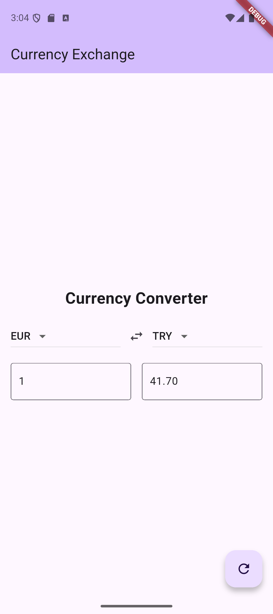

# Currency Converter

Currency Converter is an Android application developed for the quiz of SE-017 - Mobile Applications at Estonian Entrepreneurship University of Applied Sciences during the 2024-2025 spring semester.

The app allows users to convert values between various international currencies using real-time exchange rates. It features an intuitive interface with a currency swap feature and supports over 30 global currencies.

## Used Technologies

The application is built using **Flutter** and **Dart**. The `http` package is used to fetch real-time exchange rates from the [Free Currency API.](https://freecurrencyapi.com/)

# Screenshot

